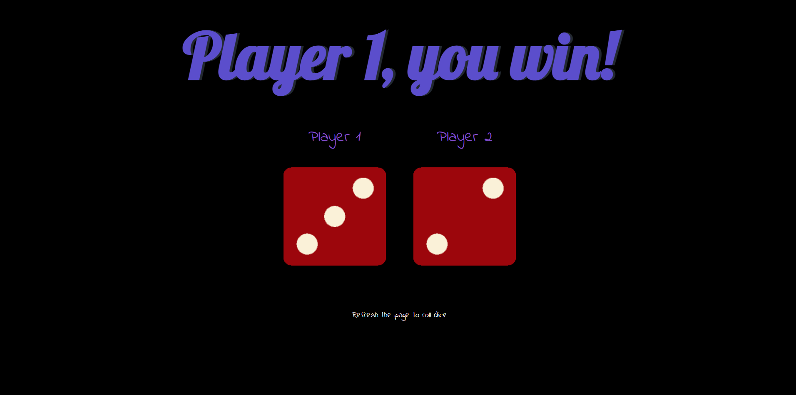

# Dicee - A Simple Dice Game

A simple web-based dice game where two players can roll the dice and the player with the higher score wins.

## Features

*   Two-player dice game.
*   Random dice roll for each player.
*   Displays the winner based on the dice roll.
*   Simple and intuitive user interface.

## Technologies Used

*   HTML
*   CSS
*   JavaScript

## How to Play

1.  Open the `dicee.html` file in your web browser.
2.  The dice will be rolled automatically, and the winner will be displayed.
3.  To play again, simply refresh the page.

## Screenshots



## Getting Started

To get a local copy up and running, follow these simple steps:

1.  Clone the repo:

```sh
git clone https://github.com/FiyinfoluwaDav/Dicee-Challenge---Starting-Files.git
```

2.  Open the `dicee.html` file in your browser.

## License

Distributed under the MIT License. See `LICENSE` for more information.
